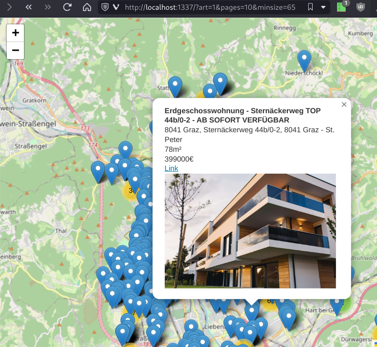

# willmap
Basierend auf den in den Suchergebnissen von [willhaben.at](https://willhaben.at) enthaltenen Koordinaten wird eine auf [leaflet.js](https://leafletjs.com/) und [openstreetmap.org](https://osm.org) basierende Karte erstellt. Die in der Karte enthaltenen Marker enthalten ebenjene in der Übersicht enthaltenen Informationen sowie den Link zur entsprechenden Anzeige. 

## browser-extension
Die Browsererweiterung läuft in Firefox und Chrome gleichermaßen. Sie fügt oberhalb der Ergebnisse der Immobiliensuche eine Karte ein. Dabei werden (im Gegensatz zu *php-standalone*) nur ebenjene gefilterte Ergebnisse angezeigt.

### Nutzung
Entweder als entpackte Extension oder Inhalt des Ordners `browser-extension`gezippt laden. 

### SHA256 für js/content.js
Um im scritp-tag mittels integrity Attribut die Echtheit der Datei zu verifizieren muss bei jeder Änderung die Checksumme angepasst werden.

  `openssl dgst -sha256 -binary js/content.js  | openssl base64 -A`

Dieser Hash ist dann in `content_scripts/willmap.js` für die Variable/Attribut `leaf_ex.integrity` einzufügen. Dabei nicht auf das führende `sha256-` vergessen.

### Bekannte Probleme / ToDo's

 - Bei Wechsel der Lokalitäten über die Postleitzahl (z.B. 8020 -> 6020) ist manchmal ein manueller Seitenreload (F5) nötig
 - Signierte Erweiterungen für den Chrome/Firefox Web Store
 - Release über GitHub CI Pipeline

## php-standalone 
**Proof Of Concept** für die Browser Erweiterung. Die URLs sind hartkodiert und müssen in der `inc/script.php` manuell geändert werden. Hiernach werden alle Suchergebnisse ohne Filter gecrawlt und angezeigt. 

Das Script besitzt lediglich 3 Parameter 

 - **pages**: Anzahl der Seiten die gecrawlt werden (bis zu 200 Einträge pro Seite)
 - **art**: Welche der hartkodierten URLs aufgerufen wird
 - **minsize**: Minimale Größe der Immobilie (mapt auf *ESTATE_SIZE*)

### Nutzung
    sudo apt-get install php-cli
    cd php-standalone/
    php -S localhost:8080
    firefox http://localhost:8080/?art=1&pages=10&minsize=65

## Screenshots

 

## Lizenzrechtliches
 - [Logo](https://github.com/mdn/webextensions-examples/blob/main/borderify/icons/border-48.png): MPL 2.0 